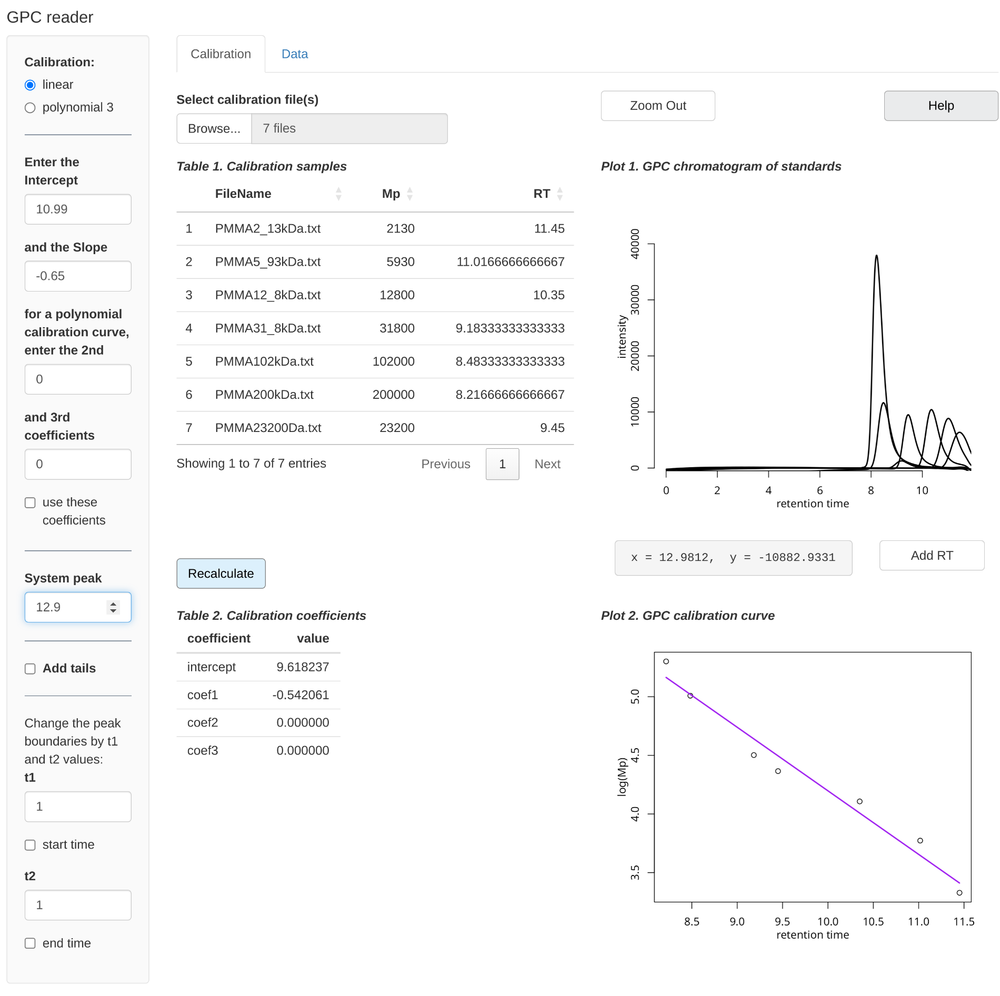
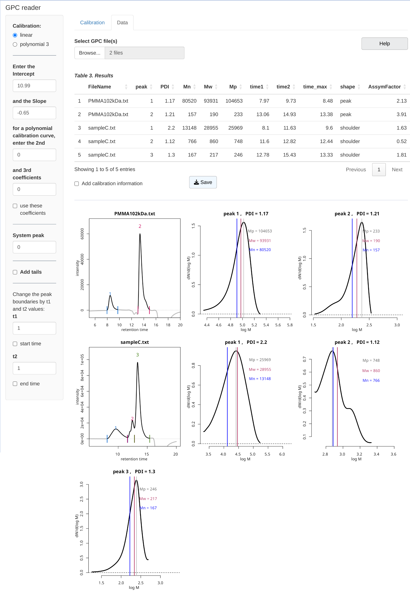

### GPC reader

This is an R Shiny application for routine calculations of Mp, average molecular weights (Mn and Mw), and PDI from GPC chromatograms (Gel permeation chromatography/size exclusion chromatography (SEC)). You can upload multiple files, inducing calibration files, and save results as csv file.

------------------------------------------------------------------------

### Packages

```{=html}
<pre>
R version 4.4.3 (2025-02-28)  

DT 0.33         purrr 1.0.2       dplyr 1.1.4.9000      stringr 1.5.1   
tidyr 1.3.1     shiny 1.9.1       here 1.0.1       

</pre>
```

### Run GPCreader from RStudio

**1.** Install R (<https://cran.r-project.org/>) and RStudio (<https://posit.co/downloads/>).

**2.** Install the R packages required by GPCreader; run the following lines in the RStudio console:

```         
install.packages("shiny")  
install.packages("tidyr")  
install.packages("stringr")
install.packages("dplyr")
install.packages("purrr")  
install.packages("DT")
install.packages("here")
```

**3.** Clone the git repository.

**4.** Open *app.R* file in Rstudio and click **Run App** (an icon located in the top right corner).

------------------------------------------------------------------------

### Usage

Instructions for use are in the file *GPC_reader.pdf*.

#### Calibration

First, set the coefficients for the calibration curve: load GPS data files with calibration standards in the "Calibration" tab, or enter *intercept* and *slope* values in the appropriate fields in the sidebar. 

#### Data

Then load the GPC file(s) in the second tab "Data".


