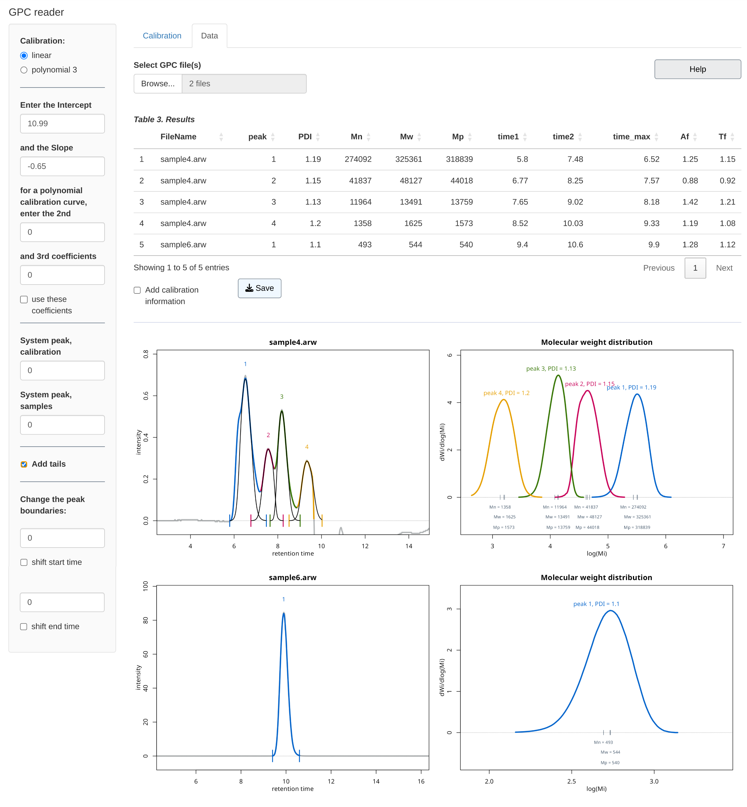

### GPC reader

This is an R Shiny application for routine calculations of Mp, average molecular weights (Mn and Mw), and PDI from GPC chromatograms (Gel permeation chromatography/size exclusion chromatography (SEC)). You can upload multiple files, inducing calibration files, and save results as csv file.

### Run GPCreader from RStudio

**1.** Install R (<https://cran.r-project.org/>) and RStudio (<https://posit.co/downloads/>).

**2.** Install the R packages required by GPCreader; run the following lines in the RStudio console:

```         
install.packages("shiny")  
install.packages("tidyr")  
install.packages("stringr")
install.packages("dplyr")
install.packages("purrr")  
install.packages("DT")
```

**3.** Open [app.R]{style="color:navy;font-weight:400;font-size:16px"} file in Rstudio and click [⏵]{style="color:seagreen;font-weight:550;font-size:14px"}[Run App]{style="color: #212f3c ;font-weight:550;font-size:14px"} (an icon located in the top right corner).

### Usage

The manual is in the file [GPC_reader_man.pdf]{style="color:navy;font-weight:400;font-size:16px"}.

#### Calibration

First, set the coefficients for the calibration curve: load GPS data files with calibration standards in the "Calibration" tab, or enter *intercept* and *slope* values in the appropriate fields in the sidebar. 

#### Data

Then load the GPC file(s) in the second tab "Data". 
